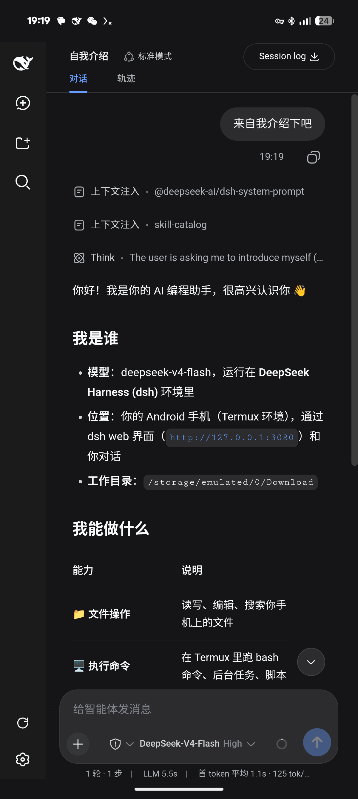
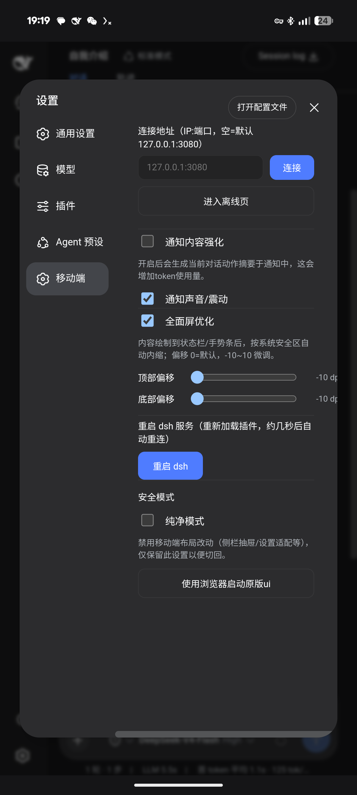
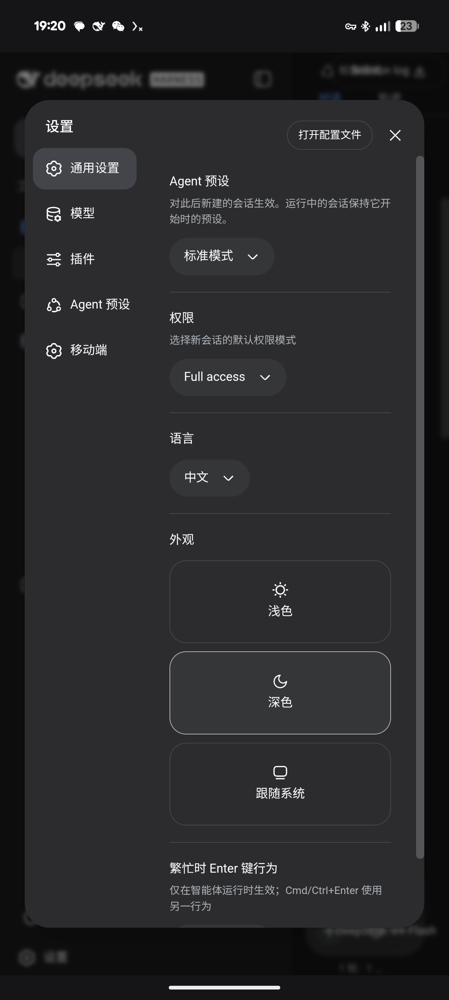

# dsh-mobile

DeepSeek Harness **dsh web** 的 Android 移动前端：WebView 壳 APK + 本地 Cordis 插件，把 dsh 变成手机上的 App 体验。

dsh（DeepSeek Harness）是 DeepSeek 官方的 AI 编码/任务框架。本项目**不 fork 上游**：所有移动端改动通过壳注入与本地插件实现，上游升级不冲突。

> **与 DeepSeek 官方无关**：本项目是独立开源项目，非 DeepSeek 出品、未经其认可或赞助；"DeepSeek" 及相关商标归其各自所有者所有。

## 特性

**壳（APK）**
- 深色一体化：状态栏/手势条与页面同色，edge-to-edge 全面屏
- 原生 insets 安全区：内容自动避开状态栏/挖孔/手势条，上下偏移可调（-10~10 dp）
- 离线自动重试 + 内置离线页（IP:端口 远程连接 + 复制一键安装脚本）

**通知（本地插件）**
- 会话进行中/完成/提问/故障状态推送，标题 = 会话标题-状态
- 正文 = 运行时间 + 待办；可开启「通知内容强化」（AI 生成动作摘要，增加 token 消耗）
- 错误码原文展示

**移动 UI（本地插件）**
- 对话栏竖屏适配、agent 预设卡片自适应
- 移动端设置选项卡：连接地址 / 通知强化 / 全面屏优化（开关+偏移）/ 重启 dsh / 安全模式
- 纯净模式：一键禁用全部移动端改动，回到原版 UI

## 界面预览

| 对话 | 移动设置 | 排版优化 |
| --- | --- | --- |
|  |  |  |

## 安装

### ① termux 直装（推荐）

1. 安装 [Termux](https://f-droid.org/packages/com.termux/)（F-Droid 版，不要用 Play 商店版）
2. Termux 里执行（脚本自动：初始化 pkg → 工具链 → 装 dsh → 原生依赖修补 → SELinux 检测 → 插件挂载）：

```bash
pkg install -y curl
curl -L -o dsh-install-termux.sh https://raw.githubusercontent.com/knGear/dsh-mobile/main/scripts/dsh-install-termux.sh
bash dsh-install-termux.sh
```

3. 安装 APK：点击 [Releases](https://github.com/knGear/dsh-mobile/releases) 下载最新版即可
4. 配置 API → 享用

### ② termux-ubuntu（稳定）

1. 安装 [Termux](https://f-droid.org/packages/com.termux/)（F-Droid 版）
2. Termux 里执行（脚本自动：初始化 → 安装 Ubuntu → 装 dsh → 插件挂载）：

```bash
pkg install -y curl
curl -L -o dsh-install-linux.sh https://raw.githubusercontent.com/knGear/dsh-mobile/main/scripts/dsh-install-linux.sh
bash dsh-install-linux.sh
```

3. 安装 APK：点击 [Releases](https://github.com/knGear/dsh-mobile/releases) 下载最新版即可
4. 配置 API → 享用

### ③ addone-mobile（已有 dsh 追加）

适用于 PC / 服务器 / Termux 等任意环境。若尚未安装 dsh，先用官方命令安装：

**官方安装 dsh：**

```bash
npm i -g @deepseek-ai/dsh
dsh web
```

> ⚠ npm 直装的 dsh 直接跑 `dsh web` 可能加载不到本地插件（bin.js 缺 `--expose-internals`）。
> 两个安装脚本会自动生成 dsh wrapper 解决；手动环境可让 AI 按仓库脚本处理。

然后安装移动端插件，按你的平台选一个（任选其一，重复运行 = 更新到最新版）：

**bash 版（Linux / macOS / Termux）：**

```bash
curl -L -o dsh-addone-mobile.sh https://raw.githubusercontent.com/knGear/dsh-mobile/main/scripts/dsh-addone-mobile.sh
bash dsh-addone-mobile.sh
```

**Node 跨平台版（Windows 等任意平台，需 Node 18+）：**

```powershell
curl.exe -L -o dsh-addone-mobile.mjs https://raw.githubusercontent.com/knGear/dsh-mobile/main/scripts/dsh-addone-mobile.mjs
node dsh-addone-mobile.mjs
```

或者，复制下面的仓库链接直接贴给 AI，让它帮你完成安装配置：

```text
https://github.com/knGear/dsh-mobile
```

最后安装 APK：点击 [Releases](https://github.com/knGear/dsh-mobile/releases) 下载最新版即可，连接本机（默认 `127.0.0.1:3080`）或远程（离线页输入 `IP:端口`），配置 API → 享用。

## 从源码构建

```bash
# 环境: proot Debian(Trixie) + aapt/javac/d8/zipalign/apksigner
git clone git@github.com:knGear/dsh-mobile.git
cd dsh-mobile && bash build.sh
# 产物: out/DSH-v<版本>.apk
```

> ⚠ 老 d8 不支持 lambda（`Unable to find method metafactory`）——Java 代码一律用匿名类。

## 项目结构

```
app/                      # Android 壳 (com.dsh.mobile, minSdk 26 / target 34)
  src/main/java/          #   MainActivity(安全区/离线重试/JS桥) + NotifyReceiver(通知)
  src/main/res/           #   图标/主题/一键安装脚本
build.sh                  # 构建脚本(proot Debian 混合构建)
release.keystore          # 发布签名(alias dshmobile, 密码随仓库公开——FOSS 实践)
icon-master.svg           # 图标源
plugins/
  cordis.patch.yml        # 插件挂载示例
  mobile-ui/              # 移动 UI 插件(设置/重启)
  mobile-AndroidNotify/   # 通知插件(状态推送/内容强化)
```

## 插件挂载

```yaml
# ~/.dsh/profiles/web/cordis.patch.yml
- insert:
    - id: mobile-notify
      name: 'mobile-AndroidNotify'
    - id: mobile-ui
      name: 'mobile-ui'
```

⚠ 带 client 的包 `exports` 必须包含 `"."` 与 `"./package.json"`；插件 id 全树唯一，用 `mobile-` 前缀避免与上游撞名。

## 兼容性

- dsh：`@deepseek-ai/dsh@0.1.0-rc.6`（npm）
- Android：minSdk 26 / target 34（Android 8.0+）
- 布局锚点只用 dsh 稳定语义属性（`data-*` / `role=`），不依赖 hash 类名，上游升级不碎
- **无 root 可用**：安装/通知/远程连接均不依赖 root（仅旧版设备的 SELinux 补丁为可选步骤，失败自动跳过）

## 版本历史

- **v0.01** — 首个公开版

## Credits

本程序使用 **DeepSeek Pro / DeepSeek Flash** 进行构建（DeepSeek Harness agent 辅助开发）。

## License

MIT © knGear
